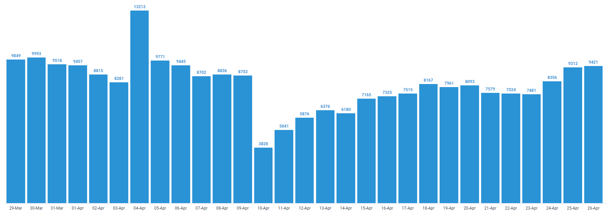
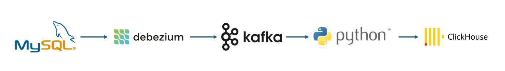
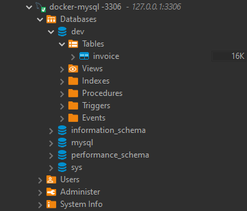
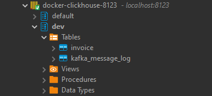
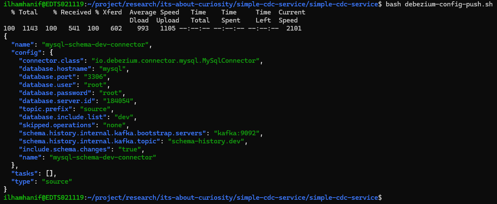
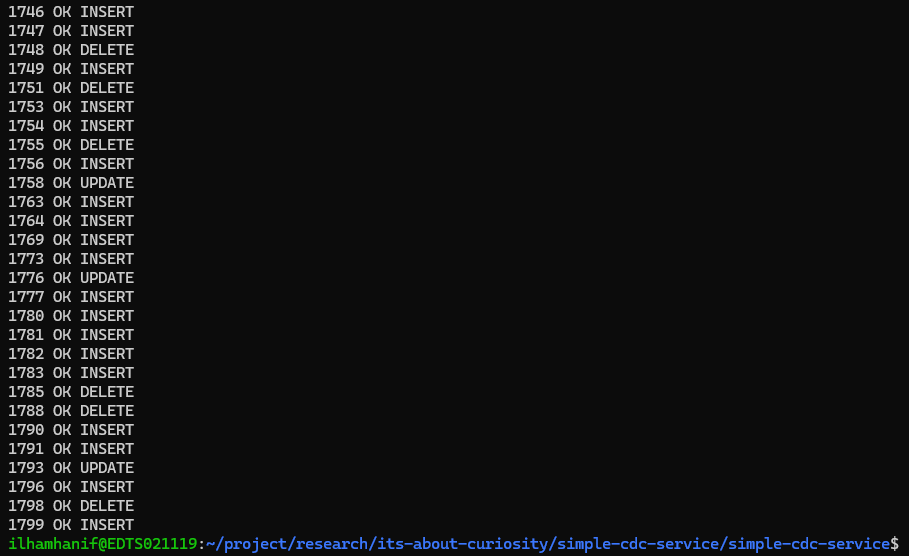
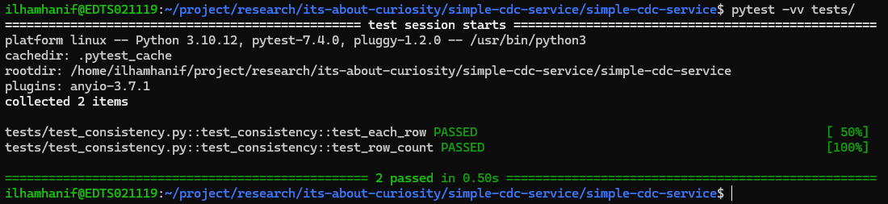

# Simple CDC Service using Debezium and Apache Kafka

## Behind Story

In many cases, data from an application, or an interface, had stored in an OLTP database right after it was captured.<br>
Because of the analytical needs, sometimes, we need to move the data into an analytic-base database OLAP.<br>
The problem is, the query used to fetch the data, consumes too many memories and makes the application going slow.

This figure shows data transaction trend within last 30 days (in million) in one case.



The solution we will explain in this article is to stream any data changes in OLTP database to OLAP database<br>
using a Change Data Capture (CDC).

## What's This Article Goal?

This article will explain on how to use a **simple Change Data Capture (CDC) Debezium** to capture any data changes from an OLTP database MySql,<br>
and use the data-stream information to synchronize the data with OLAP database.

## Architecture

This figure shows complete architecture of our solution.



List of services in this solution were listed below.

-   [MySql](https://dev.mysql.com/) as a sample of OLTP database
-   [Debezium](https://debezium.io/) as CDC tools.
-   [Apache Kafka](https://kafka.apache.org/) as message broker.
-   A Python base Kafka consumer.
-   [ClickHouse](https://clickhouse.com/) as a sample of OLAP database.

All of the services run inside docker container, which predefined on `docker-compose.yaml` script.<br>

### Deep Dive with the Services

#### Database MySql

MySql database act as an OLTP database.

```
  mysql:
    container_name: mysql
    image: mysql
    ports:
      - 3306:3306 # Used to connect to database
    environment:
      - MYSQL_ROOT_PASSWORD=root
    volumes:
      - ./mysql/init-script:/init-script
    command: --default-authentication-plugin=mysql_native_password --init-file /init-script/script.sql
```

Explanation:

-   Service name: **mysql**.
-   Port 3306 will be exposed to automate data modification using `sequencer.py` (it is explained below).
-   Default database password is _root_.
    [Click here](https://hub.docker.com/_/mysql) (do scroll until section **Environment Variable**) to change MySql configuration using Environment Variable.
-   Directory `./mysql/init-script` contains `script.sql` as initial script.<br>

#### Debezium

Debezium plays as main actor in this solution.<br>
It will capture any data changes, including INSERT/CREATE, UPDATE, DELETE, and TRUNCATE from MySql database.

```
  debezium:
    container_name: debezium
    image: debezium/connect
    ports:
      - 8083:8083 # Used to send configuration file through API /connectors
    environment:
      BOOTSTRAP_SERVERS: kafka:9092
      GROUP_ID: 1
      CONFIG_STORAGE_TOPIC: connect_configs
      OFFSET_STORAGE_TOPIC: connect_offsets
      STATUS_STORAGE_TOPIC: connect_statuses
    depends_on:
      - mysql
      - kafka
```

Explanation:

-   Service name: **debezium**.
-   Port 8083 will be exposed to setup the debezium-mysql-connector using _curl_ (will explain later).
-   From [this article](https://debezium.io/documentation/reference/stable/tutorial.html#starting-kafka-connect), it is **IMPORTANT** to set<br>
    GROUP_ID, CONFIG_STORAGE_TOPIC, STATUS_STORAGE_TOPIC as Environment Variable
-   The service start condition is depends with other services, **mysql** (source database) and **kafka** (message broker).

#### Apache Kafka

Apache Kafka act as a bridge-like message broker in this solution.<br>
It delivers all debezium messages, contains any data changes from database.<br>
Kafka consumer then consumes the message right after the message is being publish to Kafka.

```
  zookeeper:
    container_name: zookeeper
    image: zookeeper

  kafka:
    container_name: kafka
    image: bitnami/kafka
    environment:
      KAFKA_CFG_ZOOKEEPER_CONNECT: zookeeper:2181
      KAFKA_CFG_LISTENER_SECURITY_PROTOCOL_MAP: INTERNAL:PLAINTEXT,EXTERNAL_SAME_HOST:PLAINTEXT,EXTERNAL_DIFFERENT_HOST:PLAINTEXT
      # Define who can listen to Kafka
      KAFKA_CFG_LISTENERS: INTERNAL://:9092,EXTERNAL_SAME_HOST://:29092,EXTERNAL_DIFFERENT_HOST://:29093
      # Define How client (PRODUCER + CONSUMER) can connect to Kafka from various host
      KAFKA_CFG_ADVERTISED_LISTENERS: INTERNAL://kafka:9092,EXTERNAL_SAME_HOST://localhost:29092,EXTERNAL_DIFFERENT_HOST://kafka:29093
      KAFKA_CFG_INTER_BROKER_LISTENER_NAME: INTERNAL
    healthcheck:
      test: [
        "CMD-SHELL",
        "kafka-topics.sh --bootstrap-server kafka:9092 --topic healthcheck --create --if-not-exists && kafka-topics.sh --bootstrap-server kafka:9092 --topic healthcheck --describe"
      ]
      start_period: 10s
      interval: 5s
      timeout: 10s
      retries: 5
    restart: always
    depends_on:
      - zookeeper
```

Explanation:

-   Service name: **kafka**.
-   Kafka has dependency with [Apache Zookeeper](https://zookeeper.apache.org/).<br>
    Zookeeper has responsibility to maintain the Kafka service components like active brokers, topics, consumers, etc.<br>
    Kafka communicates with Zookeeper using internal docker port 2181.
-   Environment Variable:
    -   KAFKA_CFG_LISTENERS used to control which source can connect with Kafka.
    -   KAFKA_CFG_ADVERTISED_LISTENERS used to define how client application can connect with Kafka.
    -   Other Environment Variables is documented in [this documentation](https://hub.docker.com/r/bitnami/kafka) (do scroll until section Configuration/Environment Variables).

#### Kafka Consumer

Kafka Consumer was written with Python [`kafka-python`](https://pypi.org/project/kafka-python/) PyPi modules.<br>

```
  kafka-consumer:
    container_name: kafka-consumer
    build: ./kafka-consumer-service
    command: python /app/main.py
    depends_on:
      debezium:
        condition: service_started
      kafka:
        condition: service_healthy
```

Explanation:

-   Service name: **kafka-consumer**.
-   This service will be started after debezium and kafka service successfully started.

#### Database ClickHouse

CLickHouse has a role as target database.

```
  clickhouse:
    container_name: clickhouse
    image: clickhouse/clickhouse-server
    ports:
      - 8123:8123 # For Client and HTTP Interface
    volumes:
      - ./clickhouse/init-script:/docker-entrypoint-initdb.d/ # Database Initial Script
```

Explanation:

-   Service name: **mysql**.
-   Port 8123 exposed for external connection outside docker environment connect.
-   Directory `./clickhouse/init-script` contains `script.sql` as initial script.<br>
    It is mounted in `/docker-entrypoint-initdb.d` inside container,<br>
    and all `*.sql` under this folder are treated as initial script.<br>
    source: [Documentation](https://hub.docker.com/r/clickhouse/clickhouse-server/) (scroll until _How to extend this image_ section).

## Build

1. Create an empty directory as workspace.

```
mkdir simple-cdc-service
cd simple-cdc-service
```

2. Setup and activate a **Pyton Virtual Environment**.

```
python -m venv .
. /bin/activate
```

3. Clone the source code from GitHub Repository.

```
git clone https://github.com/ilhamhanif/simple-cdc-service.git
```

4. Install some Python modules.

Important Python modules listed in `requirements.txt

```
pip install -r requirements.txt
```

5. Build and start all services.

Make sure docker is already installed using command below.

```
docker --version
```


If docker was not installed, follow [this documentation](https://docs.docker.com/engine/install/) for installation process.

To build all services, use command below.

```
docker compose build && docker compose up -d
```

Note:

-   When command `-d` used, there will be no build and log printed in terminal.<br>
    To access log for specific service, use `docker container logs [service name]`

## Demonstration

Below is an order of what demonstration we will do.

1.  Inspecting source database MySql and target database Clickhouse.
2.  Creating debezium connector configuration.
3.  Running the data sequencer.
4.  Testing the data consistency between 2 database.
5.  Cleaning Up

### Inspecting Source Database MySql and Target Database CLickHouse

Before we start, we have to check source database MySql and target database ClickHouse,<br>
to make sure, our initial script for each database is run successfully.

#### MySql Database

A database **dev** and a table **invoice** is already preinstalled by script in `./mysql/init-script/script.sql`.<br>
Database was accessible thru `localhost:3306` with username _root_ and password _root_ as defined in `docker-compose.yaml` file.
I checked using tools [Dbeaver](https://dbeaver.io/).



#### ClickHouse Database

A database **dev** and a table **invoice** and **kafka_message_log** is already preinstalled by script in `./clickhouse/init-script/db-table-init.sql`.<br>
Database was accessible thru `localhost:8123` with username `default` and without any password as defined in `docker-compose.yaml` file.
I checked using same tools [Dbeaver](https://dbeaver.io/).



### 2. Creating a Debezium Connector Configuration

Debezium needs a configuration, contains information listed below.

1. Database location
2. Data changes included operation
3. Kafka location

To simplify the process, i have made a simple bash script `debezium-config-push.sh`.<br>
This script basicly does a HTTP POST request using [curl](https://curl.se/) to debezium config push endpoint in `localhost:8123`<br>
with the connector configuration as request body.<br>

Run the script with command below.

```
bash debezium-config.push.sh
```

Make sure we have the same response here.



Explanation:

-   Connector name: mysql-schema-dev-connector
-   Source database location: mysql:3306 with login username _root_ and password _root_
-   Database name: dev
-   Kafka location: kafka:9092
-   Kafka topic name prefix: source<br>
    By default, debezium will made a topic with format `source.[database-name].[table-name]` after configuration pushed,<br>
    therefore, each table in each database, will have a different topic.
-   Operation included: all<br>
    By default, [TRUNCATE operation ignored by debezium](https://debezium.io/documentation/reference/stable/connectors/mysql.html#mysql-property-skipped-operations).
-   Other configuration is follows [this documentation](https://debezium.io/documentation/reference/stable/tutorial.html#deploying-mysql-connector).

### 3. Running the Data Sequencer

Sequencer was made to automatically did multiple random DML (1800 DML) statement of INSERT/UPDATE/DELETE record to MySql database.<br>
The sequencer had written using Python as `sequencer.py`.<br>
Run the script using command below.

```
python sequencer.py
```



Any database record changes will be captured by Debezium, before forwarded to Kafka.<br>
A Kafka subscriber service able to fetch data forwarded to Kafka via its subscriber,<br>
and do action corresponds the data it capture.

1.  Insert all original message from kafka into tabel **dev.kafka_message_log**.
2.  Using information from the message, perform INSERT/UPDATE/DELETE record in table **dev.invoice** corresponds with the data.

Example of kafka message for each method store in `./kafka-consumer-service/example/`.<br>

### 4. Testing Data Consistency between 2 Database

After sequencer finished, database ClickHouse and MySql will had EXACTLY SAME records under the same table.

I've made a simple python test script in `/tests/test_consistency.py` using [pytest](https://docs.pytest.org/en/8.0.x/)<br>.
This test script had 2 tests.

1.  Check row count between 2 table in database. It must be EXACTLY SAME.
2.  Check each row between 2 table in database. It must be EXACTLY SAME.

Test command:

```
pytest -vv tests/
```

Success test was shown in this image.



### 5. Cleaning Up

Use command below to clean up everything.

```
docker compose down
```

Use command below to deactivate the Virtual Environment.

```
deactivate
```

## Reference

All references (but not limited to) to build this article.

-   https://hub.docker.com/_/mysql
-   https://hub.docker.com/r/debezium/connect
-   https://hub.docker.com/r/bitnami/kafka
-   https://hub.docker.com/r/clickhouse/clickhouse-server/
-   and many more, thanks to all.

## Another Related Topic

-   [Basic CDC Approach](https://medium.com/data-engineering-indonesia/cdc-and-scd-approach-to-enhancing-expedition-operations-3a75256c2b74)
-   [Performing Million of Message using Kafka CDC](https://medium.com/yotpoengineering/scheduling-millions-of-messages-with-kafka-debezium-6d1a105160c)
-   [Common Data Performing Use Case for CDC](https://www.ascend.io/blog/common-change-data-capture-usage-patterns/)
-   [Google Cloud Platform Managed CDC](https://cloud.google.com/datastream?hl=en)
-   [How to Use GCP Managed CDC Datastream](https://techbigdatacloud.medium.com/change-data-capture-real-time-data-transfer-to-bigquery-with-gcp-datastream-97127fa837e3)
