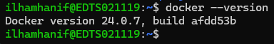

# Simple CDC Service using Debezium and Apache Kafka

## What's This Article Goal?

This article will explain on how to use a **simple Change Data Capture (CDC)** to capture any data changes from a database,<br>
and use the information to synchronize the data with other database.

## Architecture

Complete architecture is shows below.


This architecture include:

 - [MySQL](https://dev.mysql.com/) as source Database
 - [Debezium](https://debezium.io/) as CDC tools.
 - [Apache Kafka](https://kafka.apache.org/) as message broker.
 - A Python base Kafka consumer.
 - [ClickHouse](https://clickhouse.com/) as target database.

The infrastructure is served inside docker container,<br> which compiled using `docker-compose.yaml` script, for ease of use.<br>

### Deep Dive about Components Used

#### Database MySQL

MySQL database is used as source database with container configuration as mentioned below.

```
  mysql:
    container_name: mysql
    image: mysql
    ports:
      - 3306:3306 # Used to connect to database
    environment:
      - MYSQL_ROOT_PASSWORD=root
    volumes:
        - ./mysql/init-script:/init-script
    command: --default-authentication-plugin=mysql_native_password --init-file /init-script/script.sql
```

Explanation:

 - Container name: **mysql**.
 - Port 3306 is exposed to automate data update using `sequencer.py` (will explain later).
 - Default database root password is *root*. 
   [Click here](https://hub.docker.com/_/mysql) (scroll until section **Environment Variable**) to change MySQL configuration using Environment Variable.
 - Directory `./mysql/init-script` contains `script.sql` as initial script.<br>
   Therefore, this folder is mounted in `/init-script`,<br> 
   and configure the `docker-compose.yaml` file to run `script.sql` using command **--init-file**.<br>

#### Debezium

Debezium play as main actor to capture any data changes including INSERT/CREATE, UPDATE, DELETE, and TRUNCATE inside MySQL database.<br>
Debezium container is configured as below.

```
  debezium:
    container_name: debezium
    image: debezium/connect
    ports:
      - 8083:8083 # Used to send configuration file through API /connectors
    environment:
      BOOTSTRAP_SERVERS: kafka:9092
      GROUP_ID: 1
      CONFIG_STORAGE_TOPIC: connect_configs
      OFFSET_STORAGE_TOPIC: connect_offsets
      STATUS_STORAGE_TOPIC: connect_statuses
    depends_on:
      - mysql
      - kafka
```

Explanation:
 - Container name: **debezium**.
 - Port 8083 is exposed to setup the debezium-mysql-connector using *curl* (will explain later).
 - From [this article](https://debezium.io/documentation/reference/stable/tutorial.html#starting-kafka-connect), it is **IMPORTANT** to set<br>
   GROUP_ID, CONFIG_STORAGE_TOPIC, STATUS_STORAGE_TOPIC as Environment Variable
 - This container startup is depends on other container, named **mysql** (source database), and **kafka** (message broker).

#### Apache Kafka

Apache Kafka is become a bridge in this architecture, as message broker.<br>
It deliver data capture message from debezium, so consumer can consume and do action related to the message consumed.<br>
Kafka container is configured as below.

```
  zookeeper:
    container_name: zookeeper
    image: zookeeper

  kafka:
    container_name: kafka
    image: bitnami/kafka
    environment:
      KAFKA_CFG_ZOOKEEPER_CONNECT: zookeeper:2181
      KAFKA_CFG_LISTENER_SECURITY_PROTOCOL_MAP: INTERNAL:PLAINTEXT,EXTERNAL_SAME_HOST:PLAINTEXT,EXTERNAL_DIFFERENT_HOST:PLAINTEXT
      # Define who can listen to Kafka
      KAFKA_CFG_LISTENERS: INTERNAL://:9092,EXTERNAL_SAME_HOST://:29092,EXTERNAL_DIFFERENT_HOST://:29093
      # Define How client (PRODUCER + CONSUMER) can connect to Kafka from various host
      KAFKA_CFG_ADVERTISED_LISTENERS: INTERNAL://kafka:9092,EXTERNAL_SAME_HOST://localhost:29092,EXTERNAL_DIFFERENT_HOST://kafka:29093
      KAFKA_CFG_INTER_BROKER_LISTENER_NAME: INTERNAL
    healthcheck:
      test: [
        "CMD-SHELL", 
        "kafka-topics.sh --bootstrap-server kafka:9092 --topic healthcheck --create --if-not-exists && kafka-topics.sh --bootstrap-server kafka:9092 --topic healthcheck --describe"
      ]
      start_period: 10s
      interval: 5s
      timeout: 10s
      retries: 5
    restart: always
    depends_on:
      - zookeeper
```

Explanation:
 - Container name: **kafka**.
 - Kafka is having dependency to run with [Apache Zookeeper](https://zookeeper.apache.org/),<br>
   used to maintain take care of Kafka configuration like active broker, topics, consumers, etc.<br>
   Kafka communicate with Zookeeper using internal docker port 2181.
 - Environment Variable:
    - KAFKA_CFG_LISTENERS is used to control which source can connect with Kafka.
    - KAFKA_CFG_ADVERTISED_LISTENERS is used to define how client application can connect with Kafka.
    - other Environment Variable configuration purpose <br>
      is mentioned in [this documentation](https://hub.docker.com/r/bitnami/kafka) (scroll until section Configuration/Environment Variables).
 - Healthcheck is also made to make sure HA.

#### Kafka Consumer

A Kafka Cnnsumer is written using Python using [kafka-python](https://pypi.org/project/kafka-python/) modules.<br>
Kafka consumer written in python is configured as below.

```
  kafka-consumer:
    container_name: kafka-consumer
    build: ./kafka-consumer-service
    command: python /app/main.py
    depends_on:
      debezium:
        condition: service_started
      kafka:
        condition: service_healthy
```

Explanation:
 - Container name: **kafka-consumer**.
 - This container startup is depends on **debezium** and **kafka**.
    - debezium service should be started.
    - kafka service should be healthy.

#### Database ClickHouse

CLickHouse database is used as target database with container configuration as mentioned below.

```
  clickhouse:
    container_name: clickhouse
    image: clickhouse/clickhouse-server
    ports:
      - 8123:8123 # For Client and HTTP Interface
    volumes:
      - ./clickhouse/init-script:/docker-entrypoint-initdb.d/ # Database Initial Script
```

Explanation:

 - Container name: **mysql**.
 - Port 8123 is exposed for external connection outside docker environment to connect.
 - Directory **./clickhouse/init-script** contains `script.sql` as initial script.<br>
   Therefore, this folder is mounted in **/docker-entrypoint-initdb.d** inside container,<br> 
   and all `*.sql` inside this folder will be treated as initial script.<br>
   source: [Documentation](https://hub.docker.com/r/clickhouse/clickhouse-server/) (scroll until *How to extend this image*).

## Build Up Steps

1. Create an empty directory as workspace and point our command to that directory.

```
mkdir simple-cdc-service
cd simple-cdc-service
```

2. Setup and activate a **Pyton Virtual Environment**.

```
python -m venv .
. /bin/activate
```

3. Clone source code from GitHub Repository.

```
git clone https://github.com/ilhamhanif/simple-cdc-service.git
```

4. Install some Python modules.

Important Python modules is listed in `requirements.txt

```
pip install -r requirements.txt
```

5. Build and start containers.

Make sure docker is installed using command below.

```
docker --version
```



If docker is not installed, please follow [this link](https://docs.docker.com/engine/install/) for installation process.

Now, we can build and use all of components in `docker-compose.yaml` file.

```
docker compose build && docker compose up -d
```

Note:
 - command `-d` is used for detached mode, so there is no build and up logs printed in terminal.<br>
   To access logs for specific container, use ```docker container logs [container name]```

After process build and up, make sure all of the container is started and not exited,<br>
using ```docker container ls```


## How to Use and Test?

After we make sure all of service in container is started successfully, we are ready to start our journey.<br>
Here is summary of what we will do to use and test this simple sequence of service.

 1. Inspect source database MySQL and target database Clickhouse.
 2. Create debezium connector.
 3. Run a data sequencer.
 4. Test the data consistency between 2 database.
 5. Clean Up

### Inspect Source Database MySQL and Target Database CLickHouse

Before we start, we have to check source database MySQL and target database ClickHouse,<br>
to make sure, our initial script for each database is run successfully.

#### MySQL Database

For database MySQL, make sure we have a new database **dev** with a table named **invoice** inside,<br>
as we mentioned in `./mysql/init-script/script.sql`.<br>
Database is located in `localhost:3306` with username `root` and password `root` as we define in `docker-compose.yaml` file.
Here i check using tools [Dbeaver](https://dbeaver.io/).


#### 1. ClickHouse Database

For database ClickHouse, make sure we have a new database **dev** with a table named **invoice** and **kafka_message_log** inside,<br>
as we mentioned in `./clickhouse/init-script/db-table-init.sql`.<br>
Database is located in `localhost:8123` with username `default` and without any password as we define in `docker-compose.yaml` file.
Here i also check using tools [Dbeaver](https://dbeaver.io/).


### 2. Create a Debezium Connector

In order to give debezium about what database-table data changes to be captured,<br>
we have to create a connector in debezium service, run in `localhost:8123`.

To simplify the process, i have made a simple bash script `debezium-config-push.sh`.<br>
This script basicly just do a HTTP POST request using [curl](https://curl.se/) to `localhost:8123`<br>
with debezium connector configuration as request body.<br>

Run this script using command below.

```
bash debezium-config.push.sh
```

And make sure we have same response here.


Explanation:
 - Connector name: mysql-schema-dev-connector
 - Source database: mysql:3306 with login username `root` and password `root`
 - Captured database: dev
 - Kafka broker location: kafka:9092
 - Kafka broker topic name prefix: source<br>
   By default, it will make a topic with format follows rule `source.[database-name].[table-name]`, <br>
   so each table each database, will have different topic.
 - Skipped operation: none<br>
   By default, TRUNCATE operation is ignored by debezium related to this [documentation](https://debezium.io/documentation/reference/stable/connectors/mysql.html#mysql-property-skipped-operations).
 - The other is following default configuration from this [tutorial](https://debezium.io/documentation/reference/stable/tutorial.html#deploying-mysql-connector).

The configuration use connection to mysql in mysql:3306 and to kafka in kafka:9092 instead to localhost, because we are using [internal docker network](https://docs.docker.com/network/).

### 3. Run a Sequencer

Sequencer is made to automatically do random DML statement of insert/update/delete record in MySQL source database.<br>
I have made a simple python script `sequencer.py` to perform this action.<br>
Run this script using command below.

```
python sequencer.py
```


This sequencer will do loops until 1800 loop, with each loop do one of insert/update/delete action.<br>
Any data changes in result from this sequencer will be captured by Debezium and then forwarded to Kafka.<br>
A Kafka subscriber service then capture this message, and do 2 things in target database ClickHouse.

 1. Insert all original message from kafka into tabel **dev.kafka_message_log**.
 2. Using information from the message, perform insert/update/delete record in table **dev.invoice**.

Example of kafka message for each method is stored in `./kafka-consumer-service/example/`.<br>

### 4. Test Data Consistency between 2 Database

After running a sequencer, there will be many data changes in source database.<br>
Target database must be able to do EXACTLY SAME operation in order to respond any data change<br>
in source database.

Here i made a simple python test script in `/tests/test_consistency.py` using [pytest](https://docs.pytest.org/en/8.0.x/)<br>
which will do 2 test.

 1. Check row count between 2 table in database, must be EXACTLY SAME.
 2. Check each row between 2 table in database, must be EXACTLY SAME.

This result is shows if data in 2 database is successfully mirrored.


Or you can do default query within 2 database.

### 5. Clean Up

To remove all containers, use command below.

```
docker compose down
```

To deactivate Virtual Environment, use command below.

```
deactivate
```

## What's Next

There is some field to develop this simple tutorial, leveraging, or compare to other similar service.<br>
Here some article th

## Reference

All references (but not limited to) to build this article.

 - https://hub.docker.com/_/mysql
 - https://hub.docker.com/r/debezium/connect
 - https://hub.docker.com/r/bitnami/kafka
 - https://hub.docker.com/r/clickhouse/clickhouse-server/
 - and many more, thanks to all.

## Another Related Topic

 - [Basic CDC Approach](https://medium.com/data-engineering-indonesia/cdc-and-scd-approach-to-enhancing-expedition-operations-3a75256c2b74)
 - [Performing Million of Message using Kafka CDC](https://medium.com/yotpoengineering/scheduling-millions-of-messages-with-kafka-debezium-6d1a105160c)
 - [Common Data Performing Use Case for CDC](https://www.ascend.io/blog/common-change-data-capture-usage-patterns/)
 - [Google Cloud Platform Managed CDC](https://cloud.google.com/datastream?hl=en)
 - [How to Use GCP Managed CDC Datastream](https://techbigdatacloud.medium.com/change-data-capture-real-time-data-transfer-to-bigquery-with-gcp-datastream-97127fa837e3)